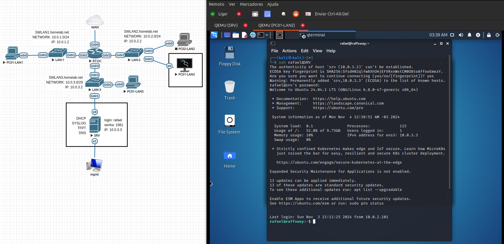

# Homelab Virtual Network Infra

Este projeto consiste em um laboratório de rede virtual, criado com o objetivo de simular um ambiente de rede center que inclui uma variedade de serviços de rede. Utilizando o EVE-NG para emulação de rede, configuramos um servidor Ubuntu para hospedar serviços essenciais como DHCP, DNS, Syslog e TFTP. Além disso, foram implementados dispositivos de rede configurados com práticas básicas de segurança.

## Visão Geral do Projeto

A infraestrutura do laboratório foi configurada para o domínio `homelab.net`, permitindo a experimentação com diferentes serviços e protocolos de rede. 

## Estrutura do Ambiente

- **Servidor Ubuntu**: Usado como base para os principais serviços de rede, incluindo:
  - **DHCP Server**: Distribuição automática de endereços IP e encaminhamento para sub-redes.
  - **DNS Server**: Resolve nomes dentro do domínio `homelab.net`.
  - **TFTP Server**: Utilizado para transferências de arquivos, como backups e atualizações de firmware.
  - **Syslog Server**: Centralização de logs dos dispositivos de rede para monitoramento e auditoria.

- **Equipamentos de Rede**:
  - **Roteadores e Switches**: Configurados com diversas funcionalidades de rede, incluindo NAT/PAT, IPv4 e protocolos de descoberta, DHCP Relay, NTP, TELNET/SSH e algumas configurações básicas de segurança para proteger o ambiente.

## Serviços Implementados

### Serviços de Rede
- **DHCP and DHCP Relay**: Serviço DHCP configurado no servidor Ubuntu para distribuir IPs nas sub-redes especificadas. O DHCP Relay foi usado para encaminhar as solicitações DHCP para o servidor principal em redes diferentes.
- **NAT/PAT**: Tradução de endereços de rede e de porta para acessar redes externas.
- **TFTP**: Configurado para transferir arquivos entre dispositivos de rede e o servidor, com o modo verbose ativado para monitoramento de transferências.
- **IPv4**: Configuração de endereços IPv4 em todas as interfaces dos dispositivos.
- **DNS**: Configuração do DNS local para o domínio `homelab.net`, permitindo a resolução de nomes de dispositivos na rede.
- **SYSLOG**: Serviço para centralizar e registrar logs de atividades e eventos dos dispositivos.
- **TELNET/SSH**: Habilitação de protocolos para gerenciamento remoto.
- **CDP/LLDP**: Protocolos de descoberta para identificação de dispositivos vizinhos.
- **NTP**: Sincronização de tempo entre os dispositivos e o servidor.

### Segurança Básica

Medidas básicas de segurança foram aplicadas para proteger os dispositivos e controlar o acesso. Essas medidas incluem:

- **Enable Password**: Senha para proteger o modo de usuário privilegiado.
- **Enable Secret**: Senha criptografada para o modo privilegiado.
- **Password for Console, AUX, Telnet, and SSH Lines**: Controle de acesso para sessões locais e remotas.
- **Hostname Configuration**: Nomeação única para cada dispositivo na rede.
- **Interface Descriptions**: Descrições para identificar a função de cada interface.
- **Username, IP Domain-Name, and Crypto Key Setup**: Configuração de nomes de usuário, domínio e chaves criptográficas para SSH.
- **Service Password Encryption**: Ativação da criptografia de senhas armazenadas no dispositivo.
- **Local Authentication**: Autenticação local para acesso seguro aos dispositivos.

## Resultados

### DHCP
- **Objetivo**: Testar a alocação automática de IP nas sub-redes LAN1, LAN2 e LAN3 através do servidor DHCP.
- **Resultado**: Clientes nas sub-redes `10.0.1.0/24`, `10.0.2.0/24` e `10.0.3.0/29` receberam IPs corretamente do SRV `10.0.3.3`, conforme esperado.

### DNS
- **Objetivo**: Direcionar todas as consultas para o servidor SRV, que hospeda o serviço de DNS, para que ele verifique e resolva as consultas DNS internas para o endereço `10.0.3.3` associado ao domínio `homelab.net`, e as consultas externas para o endereço `8.8.8.8`, associado ao domínio `dns.google`.
- **Resultado**: A resolução de nomes foi bem-sucedida para todos os dispositivos registrados.

### TFTP
- **Objetivo**: Transferir arquivos de configuração de cada dispositivo de rede para garantir backup.
- **Resultado**: Arquivos transferidos com sucesso, sendo possível visualizar todas as configurações dos equipamentos de rede no servidor `SRV`.

### Syslog
- **Objetivo**: Centralizar os logs dos dispositivos de rede para resolver possíveis problemas.
- **Resultado**: Logs recebidos com sucesso, permitindo monitoramento centralizado dos equipamentos de rede.

### SSH
- **Objetivo**: Garantir acesso remoto aos dispositivos para facilitar a resolução de problemas.
- **Resultado**: Acesso remoto realizado com sucesso através do Kali Linux usando o nome de domínio cadastrado no serviço DNS para o servidor `SRV` e o roteador `RT-DC`.

